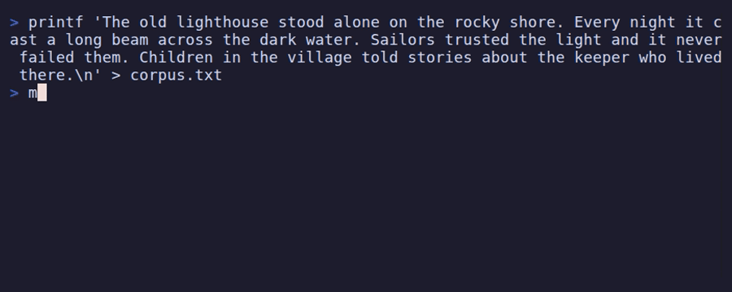

# Demos

Recordings of every tool. Each GIF is generated from a [VHS][vhs] tape in
[`docs/tapes/`](tapes); regenerate them with:

```sh
scripts/render-demos.sh
```

(That builds the tools into `./bin`, puts them on `PATH`, and runs `vhs` over
every tape. VHS needs `ttyd` and `ffmpeg` installed.)

## Visual & generative

### fractal

A Mandelbrot/Julia explorer rendered with truecolor half-blocks. Arrow keys pan,
`+`/`-` zoom, `j` toggles Julia mode using the current point as the constant,
`[`/`]` cycle palettes.


### turing

A Gray-Scott reaction-diffusion simulation. It runs the model and writes the
resulting Turing pattern to a PNG, optionally with an animated GIF of its
evolution.


## Simulation

### life

Conway's Game of Life, seeded from a real directory tree so the same folder
always produces the same starting pattern. Space pauses, `n` steps, `r` reseeds.


### sandbox

A physics sandbox: drop balls into a box and watch them fall, bounce, collide,
and settle. `g` flips gravity, `c` clears.


### battery

A cell charging and draining, drawn as the car park it behaves like.


It opens on the structure itself, drawn in 3D and turning slowly. Cars drive in
from the entrance, up the ramps and into a bay; when the cell is discharging they
reverse out and leave. Arrows orbit the camera, `z`/`x` zoom, `o` stops the spin,
and `v` switches to a flat instrument view of the same two wells for when you
want to read the numbers rather than watch the traffic.

The traffic is a simulation in its own right. Cars follow their route by pure
pursuit, steering at a point further along the path so they swing through turns
instead of pivoting, and they keep station with the Intelligent Driver Model
(Treiber, Hennecke & Helbing, 2000), which is what makes them queue on the ramp
and come to rest exactly on a bay. The aisle is two-way, with arrivals and
departures in opposite lanes. The battery model is always the authority: cars are
dispatched to make the structure agree with the charge the cell actually holds,
so the traffic on the ramp is the diffusion between the two wells made visible.
Wind the clock forward far enough and the bays settle directly, because nobody
can drive at 240x.

In the flat view each bay holds one car, and a bay always holds the same car, so
an arrival or a departure reads as a single vehicle moving rather than a bar
changing length. Deep-bay cars are dimmed because they are further away and are
not the ones that can leave.

The analogy is the model, not a decoration. Charge parks in bays. The **front
bays** sit beside the ramp and can leave the instant you ask; the **deep bays**
hold just as much charge but need time to reach the exit. Everything the tool
shows falls out of that one split:

- **Pull hard and the cell "runs out" while still half full.** The front bays
  empty faster than the ramp can refill them, terminal voltage follows the
  *front* bays rather than the total, and the cut-off trips with the deep bays
  still stocked. In the recording, the lead-acid cell hits empty at 47% state of
  charge.
- **Leave it alone and it comes back.** Cars keep walking down to the ramp after
  the load is gone, so voltage recovers and a "flat" cell will run again — the
  reason a dead torch works for another minute if you rest it.
- **Charging is the same in reverse.** A charger fills the front bays quickly,
  voltage hits the ceiling, and the rest of the charge has to trickle in at
  constant voltage while cars find their way to the back. That is the long tail
  on every phone charge.

Under the drawing:

- **Kinetic battery model** (Manwell & McGowan, 1993) for the two wells, advanced
  by the exact solution of its differential equations rather than an Euler step.
- **Shepherd/Tremblay-Dessaint curve** for terminal voltage, with its three
  parameters solved exactly through the datasheet anchors, plus a lagged current
  for polarisation and an ohmic drop for sag.
- **Arrhenius** temperature dependence on both internal resistance and the ramp
  rate, joule and entropic heating, and Newton cooling — so a cold cell both sags
  further and holds back more of its charge.
- **CC–CV charging** with an exactly solved constant-voltage branch, a trickle
  limit below freezing (lithium plating is real), and a thermal derate above
  45 °C.

Three chemistries ship with it: `liion`, `lfp` and `lead`, differing in how much
of the car park is front bays and how quickly the ramp moves. Cycle between them
with `n`.

`c` charges, `d` drains, `r` rests, `+`/`-` change the load, `<`/`>` change the
weather, and `f` winds the clock forward.

`--report` skips the drawing and measures the cell instead, discharging it at a
range of rates and fitting a Peukert exponent to the result:

```
$ battery --report --chem lead
    rate    current   runtime  delivered  of rated    energy    mean V     end T
   0.10C    0.720 A    8h 50m   6.365 Ah     88.4%  13.81 Wh   2.170 V   25.0 °C
   1.00C    7.200 A   38m 46s   4.650 Ah     64.6%   9.54 Wh   2.052 V   25.7 °C
   5.00C   36.000 A    0m 48s   0.470 Ah      6.5%   0.85 Wh   1.812 V   25.4 °C

  Peukert exponent n = 1.478
```

## Text

### markov

Trains an n-gram Markov chain on whatever text you point it at and generates new
text in that style. `--stream` prints it word by word.



## Maze

### maze

Reads or generates a maze and animates BFS or A* solving it, then traces the
shortest path in a highlight color.


## Ambient toys

### crabs

ASCII crabs race left to right at randomised speeds. There is a winner and no
prize.


### fish

A tank with exactly one fish. It drifts, faces where it's going, blows bubbles,
and is bored.


### snail

A Pomodoro timer in which a single snail crosses the screen once over the whole
session. Space pauses, `q` quits.


### garden

A zen sand garden raked with the arrow keys. Cycle patterns with `p`, reset with
`r`. No score, no end.


### duck

A rubber-duck debugging companion that only ever says "mhm", growing more
skeptical the more you explain.


[vhs]: https://github.com/charmbracelet/vhs
